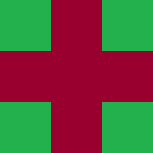

# Generowanie obrazów metodą Wave Function Collapse
Wave Function Collapse (WFC) to algorytm stosowany do generowania obrazów, map lub wzorów. Został stworzony przez Maxa Gumin i cieszy się popularnością w generatywnej sztuce, grach komputerowych oraz grafice generowanej proceduralnie Jego działanie opiera się na obliczaniu entropii elementów w tabelii i ich kolapsie do jednego elementu ze zbioru możliwych.

## Wersja pythona i zależności
- Python 3.10.12 lub  nowszy
- Pygame 2.6.0 lub nowszy

## Uruchomienie programu
Program uruchamiamy poleceniem:
main.py [-h] [--dim DIM] [--set SET] [--fps FPS]

```
Wave Function Collapse

options:
  -h, --help  show this help message and exit
  --dim DIM   Dimention of the grid (default 20)
  --set SET   Tileset (default 'extended_basic_set')
  --fps FPS   FPS (default 240)
```

## Działanie programu
Pseudokod wygląda następująco:
1. Wgranie płytek(poniżej wyjaśnie ich strukturę)
2. Stworzenie siatki 
3. Obliczenie entropii każdego elementu w siatce który jeszcze nie uległ kolapsowi.
4. Kolaps elementu o najmniejszej entropii.
5. Jeśli nie wszystkie elementy siatki uległy kolapsowi, idź do punktu 3.

### Płytki:
Są one zdefiniowane w plikach .json w katalogu tile_sets/\<wybrany zestaw\>/tiles.json. Przykład: 

<br>


<br> <br>
Powyższa płytka w pliku .json będzie opisana następująco:

```
{
"id":  0, 
"path":  "basic_set/images/tile-0.png",
"north":  [0,  2],
"east":  [0,  1],
"south":  [0,  2],
"west":  [0,  1]
}
```

Klucze north, east, south oraz west określają id płytek które moga sąsiadować z nasza płytką od danej strony. Przykładowa płytka zatem od północy sąsiadować może z płytkami o id 0 i 2, czyli: 

<div style="display=flex">


</div>

, a od wschodu z płytkami o id 0 i 1:

<div style="display=flex">


</div>

<br> <br>
W każdym zestawie płytek ostatnią pozycję zajmuje "płytka pusta". Jako że w mojej implementacji każdą pozycję na planszy zajmuje obiekt którego jednym z atrybutów jest zbiór możliwych płytek na dane miejsce, to takie rozwiązanie jest wygodne do reprezentowania pozycji
o maksymalnej entropii (można to zrobić dużo lepiej i logiczniej, ale niestety fundamenty zbudowałem na takim pomyśle więc muszę się tak ratować :c).

### Entropia
Entropią jest liczba możliwych płytek jakie 'pasują' w danym miejscu siatki.

### Kolaps:
Kolaps odbywa się poprzez znalezienie elementu w siatce o najmniejszej entropii (jeśli jest to niejednoznaczne to element wybierany jest losowo ze zbioru elementów o najmniejszej entropii)
, a następnie wybierany jest losowo element z możliwych na dane miejsce.

## Przykładowy przebieg programu

Poniżej przedstawiam róne etapy wykonywania programu (przebiegi są różne):


Pierwsza losowo wybrana płytka zajmuje losowe miejsce na planszy, kolejno obliczana jest entropia każdego pola na podstawie długości zbiorów możliwych płytek jakie mogą się na danym miejscu znaleźć. Po tej operacji losowo wybierane jest jedno pole ze zbioru tych o najmniejszej entropii i ostatecznie dochodzi do kolapsu, a więc wybrania konkretnej płytki ze zbioru możliwych.

Dobra wiadomość jest taka, że w tym programie wiemy co to znaczy i nie musimy wymyślać eksperymentów myślowych z martwymi (a może nie?) kotami aby dobrać interpretację do rzeczywistości -> https://www.youtube.com/watch?v=yB1vpsL6eXo szczerze polecam.


Na obrazku powyżej przedstawiona jest obliczona entropia. Widzimy, że jest tu tylko jedna pozycja której entropia jest równa 1 - ta pozycja więc zostanie wybrana i na niej zapisana zostanie odpowiednia płytka (krzyżyk).


## Źródła i pomocne linki
- https://github.com/mxgmn/WaveFunctionCollapse
- https://robertheaton.com/2018/12/17/wavefunction-collapse-algorithm/
- https://www.youtube.com/watch?v=rI_y2GAlQFM

